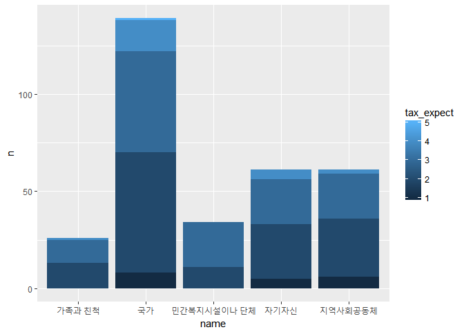
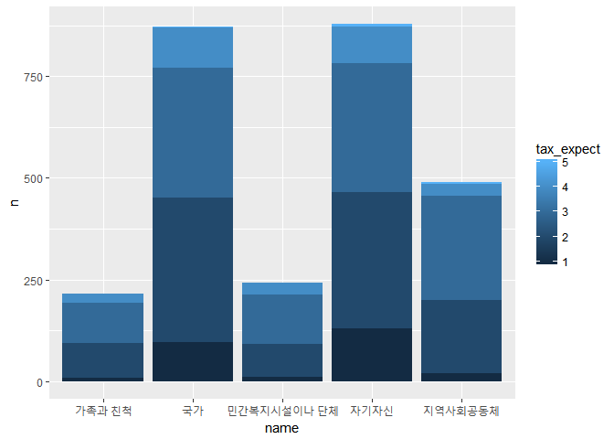
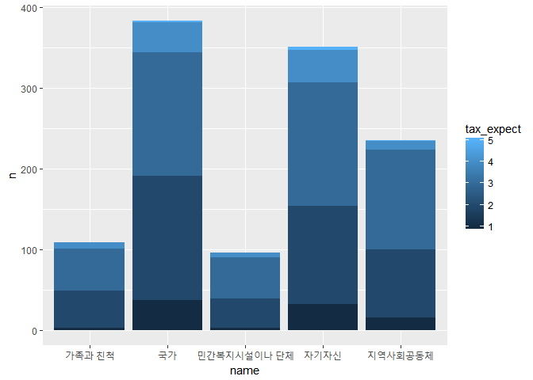
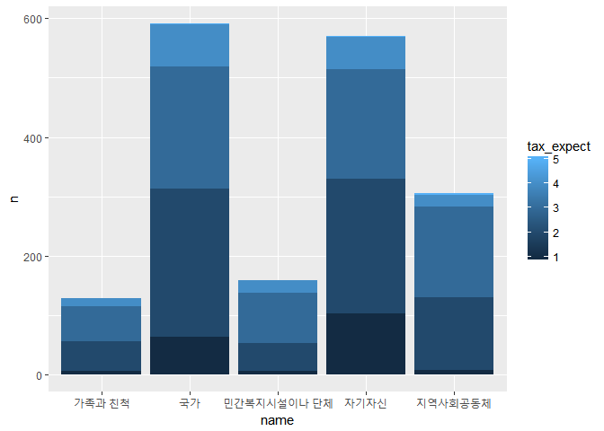

박탈감이 복지 인식에 미치는 영향 - 복지 책임의 주체와 복지에 대한 기대를 중심으로
================

1. 요약
-------

박탈감이 복지 인식에 미치는 영향을 복지의 일차적 책임 주체와 복지에 대한 기대를 중심으로 살펴보았다. 연구를 위해, 박탈감을 느꼈던 세부적인 경험을 묻는 변수들과 복지 책임의 주체를 어떤 주체로 선택했는지를 나타내는 변수를 사용하였다. 연구 결과, 박탈감을 느꼈던 사람들의 경우, 월등히 높은 비율로 국가를 책임의 주체로 선택하였다. 반면, 박탈감을 느꼈던 경험이 없는 사람들의 경우, 국가와 자기 자신을 비슷하게 가장 높은 비율로 선택하였다. 세금이 복지 혜택으로 돌아올 것이라는 기대에서는 박탈감을 느꼈던 경험이 없고 복지 책임의 주체로 국가와 자기 자신을 선택한 경우, 기대치가 낮은 것으로 나타났다.

2. 분석주제
-----------

본 연구에서는 박탈감을 느꼈던 경험이 복지 인식에 어떤 영향을 미치는지 분석할 것이다. 현대 사회에서 박탈감, 즉 소득 격차에 따른 심리적 박탈감은 사회 전반적인 분위기에 큰 영향을 미치는 것으로 나타난다. 이러한 소득 격차가 발생하는 원인은 곧 복지 책임의 일차적 주체가 누구인가라는 질문의 답이 될 수 있다. 따라서 박탈감과 복지 책임의 주체와의 관계를 알아봄으로써, 국가가 복지 정책을 위해 개선해야 할 부분을 제언할 수 있을 것이다. 또한, 복지 책임의 주체와 자신이 낸 세금이 복지혜택으로 돌아올 것이라는 기대가 어떤 관계를 맺고 있는지 알아봄으로써, 각각의 분야들에 대한 신뢰도를 예측해 볼 수 있을 것이다. 데이터를 분석하는 과정은 곧, 현재를 분석함으로써 더 나은 미래를 펼치고자 하는 것이다. 따라서 본 연구를 통해 서울시 복지 인식의 현재를 알리고, 사람들의 요구에 부합하는 정책을 펼칠 수 있도록 할 것이다.

3. 데이터 소개
--------------

#### 3.1.서울복지실태조사 데이터

서울복지실태조사 데이터는 서울 복지 정책을 수립하기 위해 2015년도에 수집한 데이터이다. '가구일반사항', '경제활동', '건강과 의료 이용', '가족생활, 여가 및 사회활동', '복지서비스 이용', '복지의식 및 욕구'의 총 6개 소분류 안에서 데이터 수집이 이루어졌다.

#### 3.2.분석에 사용할 변수

본 연구에서는 이러한 서울복지실태조사 데이터의 다양한 변수 중에서 '경제활동'의 박탈지표와 '복지의식 및 욕구'의 복지정책의 방향과 실현방안관련 의견수렴 관련 변수를 사용할 것이다.

-   F6 : 복지에 대한 일차적 책임에 관한 변수로, 내용은 "자기 자신", "가족과 친척", "지역사회공동체", "민간복지시설이나 단체", "국가"로 나타난다.
-   F8 : 자신의 세금이 복지혜택으로 돌아올 것에 대한 기대를 나타내는 변수로, 1(전혀 그렇지 않다)~5(매우 그렇다)까지 척도로 나타난다.
-   B7\_1 : '집세가 밀렸거나 못 낸 적이 있다'에 대해 '예', '아니오'로 응답받은 변수이다.
-   B7\_2 : '공과금(사회보험료와 전기요금, 전화요금, 수도요금 등)을 기한 내 납부하지 못한 적이 있다'에 대해 '예', '아니오', '비해당'으로 응답받은 변수이다.
-   B7\_3 : '자녀(대학생 포함)의 공교육비를 못 낸 적이 있다'에 대해 '예', '아니오'로 응답받은 변수이다.
-   B7\_4 : '경제적 이유로 식사 양을 줄이거나 식사를 거른 적이 있다'에 대해 '예', '아니오', '비해당'으로 응답받은 변수이다.
-   B7\_5 : '건강보험료를 미납한 적이 있다'에 대해 '예', '아니오'로 응답받은 변수이다.
-   B7\_6 : '본인이나 가족이 아파도 병원에 갈 수 없었던 적이 있다'에 대해 '예', '아니오'로 응답받은 변수이다.
-   B9 : 서울에서 살아가는데 필요한 적정한 생활비(월평균/만원)을 나타낸 변수이다.
-   B10\_Total : 2014년 연간 총 가구 소득 총액(연간총/만원)을 나타낸 변수이다.

4. 분석
-------

### 4.1. 분석 목적 및 방법

본격적으로 분석을 시작하기 전에 앞으로 활용하게 될 dplyr, readxl, ggplot2 패키지와 분석에 사용할 데이터(서울복지실태조사)를 불러온다.

``` r
library(dplyr) 
```

    ## 
    ## Attaching package: 'dplyr'

    ## The following objects are masked from 'package:stats':
    ## 
    ##     filter, lag

    ## The following objects are masked from 'package:base':
    ## 
    ##     intersect, setdiff, setequal, union

``` r
library(readxl)
library(ggplot2)
raw_survey <- read_excel("2015_서울복지실태조사_데이터.xlsx")
survey <- raw_survey
```

-   분석 중, 파일이 변형되는 것을 막기 위하여, 데이터를 백업하는 작업도 함께 한다.

### 4.2. 전처리

전체 데이터 중, 앞으로 사용하게 될 F6("복지에 대한 일차적 책임"), F8("세금부과한만큼 복지혜택 돌아올거라는 기대"), B7\_1~B7\_6(박탈지표)만을 담은 데이터 프레임을 만들었다.

``` r
survey_1 <- survey %>%
  select(F6, F8, B7_1, B7_2, B7_3, B7_4, B7_5, B7_6, B9, B10_Total)
```

박탈감에 대한 경험에 대한 변수인 B7\_1~B7\_6 변수를 제외한 F6과 F8 변수는 변수 이름을 이해하기에 용이하도록 바꾸었다.

``` r
survey_1 <- rename(survey_1,
                   response = F6,
                   tax_expect = F8,
                   need = B9,
                   income_tot_y = B10_Total)
```

척도로 나타나는 tax\_expect변수와 '예' 혹은 '아니오'로 답변이 구성되는 B7\_1~B7\_6을 제외한 response변수는 left\_join을 이용하여 이름을 추가했다.

``` r
#복지 책임의 주체를 나타내는 데이터프레임 생성
name <- data.frame(response = c(1, 2, 3, 4, 5),
                   name = c("자기자신",
                            "가족과 친척",
                            "지역사회공동체",
                            "민간복지시설이나 단체",
                            "국가"))
#데이터 프레임과 기존 데이터를 포함한 새로운 데이터 생성
survey_data <- left_join(survey_1, name, by = "response")
```

### 4.3. 분석 및 해석

#### 4.3.1. 박탈감을 느낀 경험이 있는 경우

우선, 박탈감을 느낀 경험이 있는 사람들이 몇 명인지 알아보았다.

``` r
#박탈지표에 한번에라도 '예'라고 대답한 사람들을 추출
survey_data %>%
  filter(B7_1 == 1 | B7_2 == 1 | B7_3 == 1 | B7_4 == 1 | B7_5 == 1 | B7_6 == 1) %>%
  summarise(n = n())
```

    ## # A tibble: 1 x 1
    ##       n
    ##   <int>
    ## 1   321

박탈감을 느꼈던 사람들이 어떤 주체를 복지 책임의 일차적 책임이 있다고 생각하는지, 그리고 각각의 주체는 몇 퍼센트 정도 차지하고 있는지 알아보았다. 또한, 그러한 주체가 복지 책임의 일차적 주체가 된다고 생각할 때, 자신의 세금이 복지혜택으로 돌아올 것이라는 기대를 어느 정도 하고 있는지 평균을 통해 알아보았다.

``` r
#추출한 사람들을 바탕으로, 복지 책임 주체로 분류하고, 빈도, 퍼센트, 복지 기대 변수의 평균으로 요약
survey_data %>%
  filter(B7_1 == 1 | B7_2 == 1 | B7_3 == 1 | B7_4 == 1 | B7_5 == 1 | B7_6 == 1) %>%
  group_by(name) %>%
  summarise(n = n(),
            pct = n()/321*100,
            mean_expect = mean(tax_expect)) %>%
  select(name, pct, mean_expect) %>%
  arrange(desc(pct))
```

    ## # A tibble: 5 x 3
    ##   name                    pct mean_expect
    ##   <fct>                 <dbl>       <dbl>
    ## 1 국가                  43.3         2.57
    ## 2 자기자신              19.0         2.46
    ## 3 지역사회공동체        19.0         2.34
    ## 4 민간복지시설이나 단체 10.6         2.68
    ## 5 가족과 친척            8.10        2.54

#### 4.3.2. 박탈감을 느낀 경험이 없는 경우

우선, 박탈감을 느낀 경험이 없는 사람들이 몇 명인지 알아보았다.

``` r
#한 번이라도 박탈지표에 '예'라고 대답한 적 없는 사람들을 추출
survey_data %>%
  filter(B7_1 != 1 & B7_2 != 1 & B7_3 != 1 & B7_4 != 1 & B7_5 != 1 & B7_6 != 1) %>%
  summarise(n = n())
```

    ## # A tibble: 1 x 1
    ##       n
    ##   <int>
    ## 1  2698

위와 마찬가지로, 박탈감을 느낀 경험이 없는 사람들이 어떤 주체를 복지 책임의 일차적 책임이 있다고 생각하는지, 그리고 각각의 주체는 몇 퍼센트 정도 차지하고 있는지 알아보았다. 또한, 그러한 주체가 복지 책임의 일차적 주체가 된다고 생각할 때, 자신의 세금이 복지혜택으로 돌아올 것이라는 기대를 어느 정도 하고 있는지 평균을 통해 알아보았다.

``` r
#추출한 사람들을 바탕으로 '박탈감을 느낀 경험이 있는 사람들'을 대상으로 분석한 것과 동일한 방식으로 분석
survey_data %>%
  filter(B7_1 != 1 & B7_2 != 1 & B7_3 != 1 & B7_4 != 1 & B7_5 != 1 & B7_6 != 1) %>%
  group_by(name) %>%
  summarise(n = n(),
            pct = n()/2698*100,
            mean_expect = mean(tax_expect)) %>%
  select(name, pct, mean_expect) %>%
  arrange(desc(pct))
```

    ## # A tibble: 5 x 3
    ##   name                    pct mean_expect
    ##   <fct>                 <dbl>       <dbl>
    ## 1 자기자신              32.5         2.44
    ## 2 국가                  32.4         2.49
    ## 3 지역사회공동체        18.1         2.63
    ## 4 민간복지시설이나 단체  9.01        2.70
    ## 5 가족과 친척            7.97        2.63

#### 4.3.3. 그래프

-   박탈감을 느낀 경험이 있는 경우

``` r
#추출한 사람들을 바탕으로 복지 책임 주체와 복지 혜택에 대한 기대로 나누고, 빈도로 요약
dep_resp_g <- survey_data %>%
  filter(B7_1 == 1 | B7_2 == 1 | B7_3 == 1 | B7_4 == 1 | B7_5 == 1 | B7_6 == 1) %>%
  group_by(name, tax_expect) %>%
  summarise(n = n())

#x축을 복지 책임 주체, y축을 빈도, y축 막대 내용을 복지 혜택에 대한 기대로 설정하여 그래프 생성
ggplot(data = dep_resp_g, aes(x = name, y = n, fill = tax_expect)) + geom_col()
```



그래프로 표현할 때는, tax\_expect의 척도가 각각 어느 정도 차지 하는지 알아보기 위해, 함수를 다르게 구성하였다.

-   박탈감을 느낀 경험이 없는 경우

``` r
#박탈감을 느낀 경험이 있는 경우와 동일한 방식으로 분석
dep_resp_g_2 <- survey_data %>%
  filter(B7_1 != 1 & B7_2 != 1 & B7_3 != 1 & B7_4 != 1 & B7_5 != 1 & B7_6 != 1) %>%
  group_by(name, tax_expect) %>%
  summarise(n = n())

#위와 동일한 방식으로 그래프 생성
ggplot(data = dep_resp_g_2, aes(x = name, y = n, fill = tax_expect)) + geom_col()
```



#### 4.3.4. 해석

##### - 복지에 대한 일차적 책임의 주체

박탈감을 느낀 경험이 있는 사람들의 경우, 복지에 대한 일차적 책임의 주체로 "국가"를 가장 많이 선택했다. "국가"를 선택한 사람들은 전체 박탈감을 느낀 경험이 있는 사람들 중 43%로 압도적인 비율로 1위를 차지했다. 뒤이어, "자기자신"과 "지역사회공동체"는 각각 19%를 차지했다. 4위는 "민간복지시설이나 단체", 5위는 "가족과 친척"이 차지했다. 박탈감을 느낀 경험이 없는 사람들의 경우, "자기자신"과 "국가"를 각각 1, 2위로 선택했다. 그러나 "자기자신"과 "국가"는 전체에서 각가 32.5%, 32.4%로 크게 차이가 나지 않는 것으로 나타났다. "지역사회공동체"가 약 18%로 3위를 차지하였고, "민간복지시설이나 단체"와 "가족과 친척"이 각각 4, 5위를 차지하였다. 박탈감을 느낀 경험이 있는 사람들과 그렇지 않은 사람들이 "지역사회공동체", "민간복지시설이나 단체", "가족과 친척"을 복지에 대한 일차적 책임의 주체로 선택한 비율은 거의 차이가 나지 않는다. 그러나 "국가", "자기자신"을 선택한 비율은 높게 차이가 났다.

##### - 세금부과한 만큼 복지혜택이 돌아올 것이라는 기대

그래프를 통해 확인해 본 결과, 각 주체별로 복지혜택에 대한 기대의 척도가 비슷한 양상으로 전개된다는 것을 확인할 수 있었다. "국가"와 "자기자신", "지역사회공동체"를 일차적 책임의 주체로 선택한 사람들의 경우, 세금이 복지혜택으로 돌아올 것이라는 기대에 '전혀 그렇지 않다'라고 평가한 비율이 높았고, '그렇지 않다'와 '보통이다'의 경우 비슷한 비율로 나타났다. 그러나 박탈감이 없는 사람들의 경우, "자기자신"을 복지의 일차적 책임 주체로 선택한 비율이 "국가"와 비슷하게 나타난 것처럼, 복지혜택의 양상도 두 주체가 비슷하게 전개되었다.

5. 논의
-------

### 5.1. 한계점 및 비판점

##### 1) 변수의 특성

본 연구에 사용된 변수 중, B7\_1~B7\_6의 변수들은 박탈감을 느끼는 상황들을 나타내는 변수들이다. 그런데, 실제 사회에서 박탈감을 느끼는 상황은 이러한 상황보다 훨씬 더 많을 수 있다. 단순히 생계유지 혹은 교육, 치료 등을 위한 소비를 못했던 경험을 박탈감을 경험했던 것으로 일반화하기에는 무리가 있다. 이를 테면, 자신이 현재 가진 경제적 위치보다 더 높은 위치에 있는 사람들과 교류했던 경험, 생필품이 아닌 품목에서 자신이 원하는 소비를 경제적인 이유로 하지 못했던 경험 등 더욱 다양한 경험들이 박탈감을 느꼈던 경험에 포함될 수 있기 때문이다. 또한, 복지에 대한 일차적 책임의 주체 중 "지역사회공동체"의 경우, 사람마다 주관적으로 인식하는 범위가 다를 수 있다. "지역사회공동체"를 서울로 한정시할 것인지, 지역구로 한정할 것인지, 혹은 개인이 정서적 소속감을 지니고 있는 공동체로 인식하는지 등에 따라 선택 여부가 달라질 수 있을 것이다.

###### \* 추가분석

변수 설명에서 언급한 B10\_Total 변수 (2014년 연간 총소득)와 B9 변수(서울에서 살아가는 데 필요한 적정한 생활비)의 차이가 음수로 나타나는 경우, 박탈감을 느낀 경험이 있을 것이라고 가정한 뒤, 박탈감이 있는 경우와 없는 경우를 나누어 분석한 것과 동일한 방식으로 분석을 했다. 분석을 하기에 앞서, "모름/무응답"항목을 결측치로 처리하고, 결측치가 어느 정도 되는지 확인해 본다.

``` r
#모름/무응답 항목의 값이 999999, 9999이므로 해당 값을 가진 변수를 결측 처리
survey_data$income_tot_y <- ifelse(survey_data$income_tot_y == 999999, NA, survey_data$income_tot_y)
survey_data$need <- ifelse(survey_data$need == 9999, NA, survey_data$need)
#결측치의 수
table(!is.na(survey_data$income_tot_y))
```

    ## 
    ## FALSE  TRUE 
    ##    83  2936

``` r
table(!is.na(survey_data$need))
```

    ## 
    ## FALSE  TRUE 
    ##     8  3011

우선, 연간 총소득과 필요한 최소 생계비를 비교하기 위해 연간 총소득을 12로 나눈 변수를 추가하고, 두 변수의 차이를 나타내는 변수, 이것을 자신이 생각하는 최저 생계비로 나눈 변수를 추가했다.

``` r
#결측치 제외 후, 각각의 변수 생성
survey_data_extra <- survey_data %>%
  filter(!is.na(income_tot_y) & !is.na(need)) %>%
  mutate(income_tot = income_tot_y / 12,
         gap = income_tot - need,
         gap_grade = ifelse(gap < 0, "exp", "n_exp"))

#적정 생계비가 자신의 소득보다 큰 경우, 작은 경우가 각각 어느 정도 인지 분석
table(survey_data_extra$gap_grade)
```

    ## 
    ##   exp n_exp 
    ##  1174  1754

1)적정한 생활비보다 자신의 소득이 적은 경우

``` r
#복지 책임 주체로 분류하고, 빈도, 퍼센트, 복지 혜택에 대한 기대로 요약(위에서 했던 분석방식과 동일)
survey_data_extra %>%
  filter(gap_grade == "exp") %>%
  group_by(name) %>%
  summarise(n = n(),
            pct = n()/1174*100,
            mean_expect = mean(tax_expect)) %>%
  select(name, pct, mean_expect) %>%
  arrange(desc(pct))
```

    ## # A tibble: 5 x 3
    ##   name                    pct mean_expect
    ##   <fct>                 <dbl>       <dbl>
    ## 1 국가                  32.6         2.51
    ## 2 자기자신              29.9         2.61
    ## 3 지역사회공동체        20.0         2.57
    ## 4 가족과 친척            9.28        2.60
    ## 5 민간복지시설이나 단체  8.18        2.62

2)적정한 생활비보다 자신의 소득이 높은 경우

``` r
#위 분석과 동일
survey_data_extra %>%
  filter(gap_grade == "n_exp") %>%
  group_by(name) %>%
  summarise(n = n(),
            pct = n()/1754*100,
            mean_expect = mean(tax_expect)) %>%
  select(name, pct, mean_expect) %>%
  arrange(desc(pct))
```

    ## # A tibble: 5 x 3
    ##   name                    pct mean_expect
    ##   <fct>                 <dbl>       <dbl>
    ## 1 국가                  33.7         2.49
    ## 2 자기자신              32.6         2.34
    ## 3 지역사회공동체        17.4         2.63
    ## 4 민간복지시설이나 단체  9.01        2.76
    ## 5 가족과 친척            7.35        2.64

3)적정한 생활비보다 자신의 소득이 적은 경우 - 그래프

``` r
#위의 연구에서 그래프를 그렸던 방식과 동일
extra_g1 <- survey_data_extra %>%
  filter(gap_grade == "exp") %>%
  group_by(name) %>%
  group_by(name, tax_expect) %>%
  summarise(n = n())

ggplot(data = extra_g1, aes(x = name, y = n, fill = tax_expect)) + geom_col()
```



4)적정한 생활비보다 자신의 소득이 높은 경우 - 그래프

``` r
#위의 연구에서 그래프를 그렸던 방식과 동일
extra_g2 <- survey_data_extra %>%
  filter(gap_grade == "n_exp") %>%
  group_by(name) %>%
  group_by(name, tax_expect) %>%
  summarise(n = n())

ggplot(data = extra_g2, aes(x = name, y = n, fill = tax_expect)) + geom_col()
```



위의 분석 결과를 확인해보면, 박탈지표로 분석을 할 때와 다르게, gap\_grade 변수의 두 항목수가 크게 차이나지 않으며, 분석한 결과 또한 크게 차이나지 않음을 알 수 있다. 이를 통해, '박탈감'은 분석자의 시각에 따라 다양하게 분석될 수 있다는 것을 알 수 있다. 또한, 연간 총 소득변수의 경우 결측치가 83개 있는데, 이는 본인의 소득에 부정적인 감정을 느껴 외부에 공개하기 싫은 "박탈감"을 표현할 수도 있는 자료라고 볼 수도 있다. 따라서, 객관적인 수치를 사용하더라도, "박탈감"을 측정할 수 있는 객관적인 데이터를 수집할 때 어려움이 있을 수 있음을 알 수 있다. 따라서, 추후에 분석을 하게 된다면, 충분한 논의를 통해, 대부분의 사회구성원이 동의할 수 있는, 박탈감에 관한 지표를 설정하고 신중하게 수집하여 분석해야할 것이다.

##### 2) 주관적 판단에 의한 분석

본 연구에서 주관적으로 판단하여 분석한 부분은 "박탈감을 느낀 경험" 여부를 설정한 것이다. 위에 언급한 것처럼 변수 자체가 주관적 판단의 여지가 있기도 하지만, 데이터에 있는 변수들 중, 어떤 것은 개인에 따라 박탈감을 느끼지 않을 수도 있을 것이다.

### 5.2. 추후 분석 방향

본 연구를 보완하기 위하여, "박탈감"에 대한 데이터를 수집할 필요가 있을 것이다. 본 연구에 사용된 데이터에 나타난 것과 같이 박탈감을 느꼈던 경험을 돌려서 표현하는 것이 아니라, 박탈감을 느낀 경험이 있는지 여부를 척도를 통해 조사하는 등의 방식으로 객관적인 데이터를 수집하여 분석할 수 있을 것이다. 또한 본 연구를 통한 실질적인 목적은 정책 수립에 도움이 되고자 하는 것이다. 따라서, 본 연구와 연계하여 박탈감을 느꼈던 경험이 있는 주체들이 어떤 복지 정책을 필요로 하는지 등을 알아본다면, 소득 격차를 줄이기 위한 정책 수립에 큰 도움이 될 것이다.

------------------------------------------------------------------------

데이터 출처 : 서울복지실태조사, 서울연구데이터베이스 - <http://data.si.re.kr/seoulphoto>
